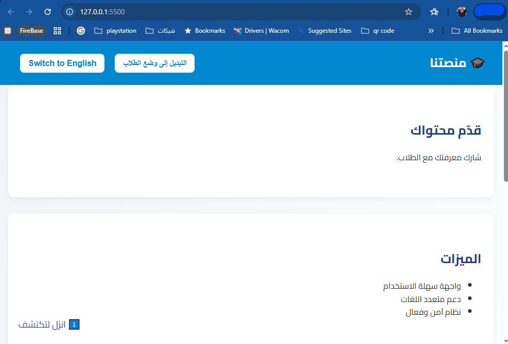

# 🎓 Content Platform Landing Page

## 📖 Description (الوصف)

### English
An interactive educational landing page that supports **Arabic and English**, fully responsive across all devices (Laptop, Tablet, Mobile, iOS, Android).  
Includes animated sections on scroll, welcome popup, and a bouncing scroll-down arrow.  
Built with pure **HTML, CSS, and JavaScript**.

### بالعربية
صفحة هبوط تعليمية تفاعلية تدعم **اللغة العربية والإنجليزية**، متجاوبة بالكامل مع جميع الأجهزة (حاسوب، تابلت، موبايل، iOS، Android).  
تتضمن أقسام متحركة عند النزول، إشعار ترحيبي، وسهم متحرك لإرشاد المستخدم للنزول.  
تم بناؤها باستخدام **HTML و CSS و JavaScript فقط**.

---

## ✨ Features (المميزات)
- 🌍 Multi-language support (Arabic / English) — دعم متعدد اللغات (العربية / الإنجليزية)
- 📱 Responsive design for all devices — تصميم متجاوب مع جميع الأجهزة
- 🎨 Modern clean UI with Google Cairo font — تصميم عصري بخط كايرو
- 🎬 Animations: scroll reveal, welcome popup, bouncing arrow — حركات أنيميشن عصرية
- ⚡ Lightweight: pure HTML + CSS + JS — خفيف وسريع بدون مكتبات

---

## 📂 Project Structure (هيكل المشروع)
```
.
├── index.html    # الصفحة الرئيسية
├── style.css     # التنسيقات (CSS)
├── script.js     # منطق الصفحة (JavaScript)
└── README.md     # ملف التوثيق
```

---

## 🚀 Live Demo
👉 [GitHub Pages Link](https://github.com/ashrafehsan/content-platform-landing))  

---

## 🖼️ Screenshots (لقطات شاشة)
### Desktop (سطح المكتب)


### Mobile (الموبايل)


---

## ⚙️ How to Run Locally (طريقة التشغيل محليًا)
1. Clone the repo:
   ```bash
   git clone https://github.com/USERNAME/content-platform-landing.git
   ```
2. Open `index.html` in any modern browser.

---

## 👨‍💻 Developer (المطور)
- Name: **Ashraf Ehsan**  
- Portfolio: [مستقل - حسابك]  
- Email:ashrafehsan@gmail.com  

---

## 📜 License (الرخصة)
MIT License — مشروع مفتوح المصدر يمكنك استخدامه أو تعديله بحرية.
